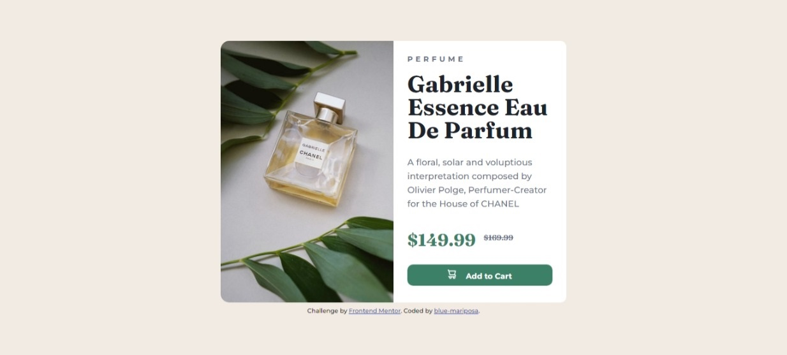
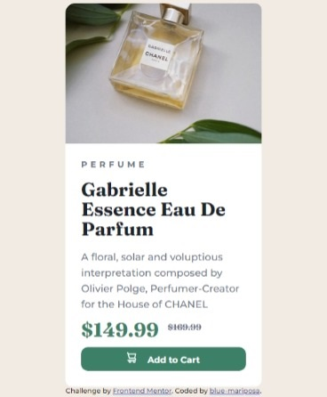

# Frontend Mentor - Product preview card component solution

This is a solution to the [Product preview card component challenge on Frontend Mentor](https://www.frontendmentor.io/challenges/product-preview-card-component-GO7UmttRfa). Frontend Mentor challenges help you improve your coding skills by building realistic projects. 

## Table of contents

- [Overview](#overview)
  - [Screenshot](#screenshot)
- [My process](#my-process)
  - [Built with](#built-with)
  - [What I learned](#what-i-learned)
  - [Continued development](#continued-development)
  - [Useful resources](#useful-resources)
- [Author](#author)
- [Acknowledgments](#acknowledgments)

## Overview

This project was built with accessibility in mind. Did research on suitable tags and attributes that would be accessible to screen readers. Decided to use main and section tags instead of div tag beacasue divs and spans cannot be read by screen readers. I used grid and flex for the layout. Couldnot get it to fit properly on a 375px screen so i limited it to 520px.

### Screenshot

## My process
- Took notes of the requirements of the project and research needed.
- Wrote down the structure and classes i may need. [notes.md](./notes.md)
- Created my folder structure.
  - product-preview-component
    - css 
    - images 
    - screenshots 
    - fonts 
    - index.html 
    - readme.md 
- Created the html.
- Created the css.
  - Imported the Montserrat and Fraunces fonts from google fonts.
  - Used Flex-Box to center the component and grid for the inner layout.
  - Created the media query for mobile devices.
- Took screenshots.

## Note: I included the fonts offline because i donot have constant access to the internet. However, i have commented out the CSS font-face and included the google font link in the HTML head.     

### Built with

- Semantic HTML5 markup
- CSS custom properties
- Flexbox
- CSS Grid
- Microsoft Edge
- VS-Code

### What I learned

- Initially, i used the image tag to add the two images and used css to show and or hide one at the specified screen sizes. Later, i found out the best method would be to use the picture tag.
- 
- This is the first time i used an svg which made curious enough to research html unicodes that could be used to create icons.

### Continued development

- Learn more accessiblity features.
- Best conditions for applying max-width or min-width.
- Reducing my css code.

### Useful resources

- [HTML Unicode](https://www.w3schools.com/charsets/ref_html_utf8.asp) - This helped in understanding HTML Unicode.
- Some great tutorials by 'Traversy Media' and 'Web Dev Simplified'
  - [CSS Grid layout](https://www.youtube.com/watch?v=0xMQfnTU6oo)
  - [CSS Flex-box layout](https://www.youtube.com/watch?v=3YW65K6LcIA)

## Author

- Frontend Mentor - [@blue-mariposa](https://www.frontendmentor.io/profile/blue-mariposa).

## Acknowledgments

- Thanks to Frontend Mentor for the guide(s) [Link](https://www.frontendmentor.io).

- Thanks to @MelvinAguilar for your comment and suggestions [Link](https://www.frontendmentor.io/profile/MelvinAguilar).
